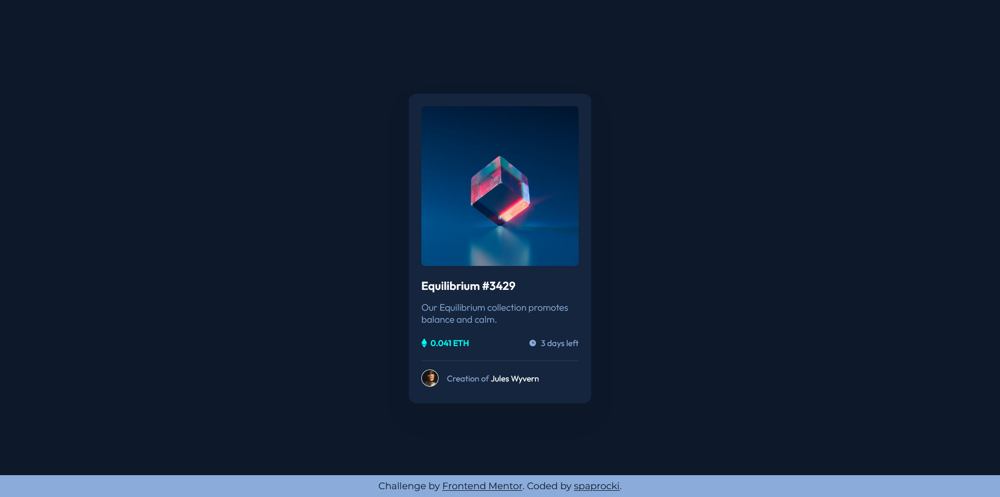
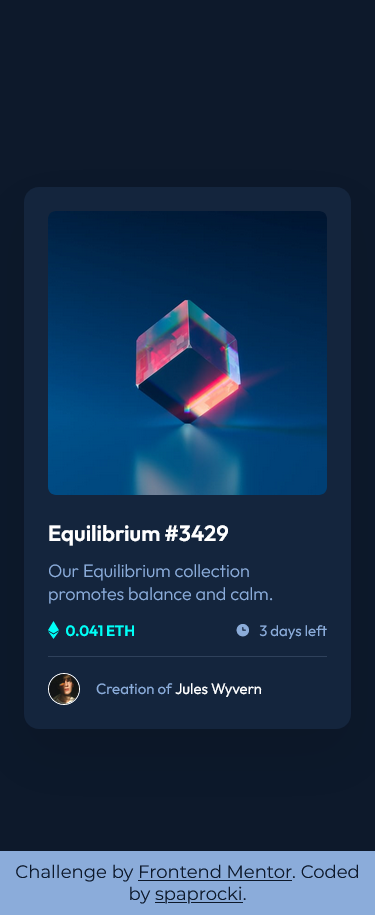

# Frontend Mentor - QR code component solution

This is a solution to the [NFT preview card component challenge on Frontend Mentor](https://www.frontendmentor.io/challenges/nft-preview-card-component-SbdUL_w0U). Frontend Mentor challenges help you improve your coding skills by building realistic projects.

## Table of contents

- [Overview](#overview)
  - [Screenshot](#screenshot)
  - [Links](#links)
- [Built with](#built-with)
- [Author](#author)

## Overview

### Screenshot

### Links

- Solution URL: [solution](https://github.com/spaprocki/nft-preview-card-component)
- Live Site URL: [live site](https://spaprocki-nft-preview-card.netlify.app/)

## Built with

- Semantic HTML5 markup
- CSS custom properties
- Flexbox
- Mobile-first workflow

## Author

- Website - [Add your name here](https://github.com/spaprocki)
- Frontend Mentor - [@spaprocki](https://www.frontendmentor.io/profile/spaprocki)
